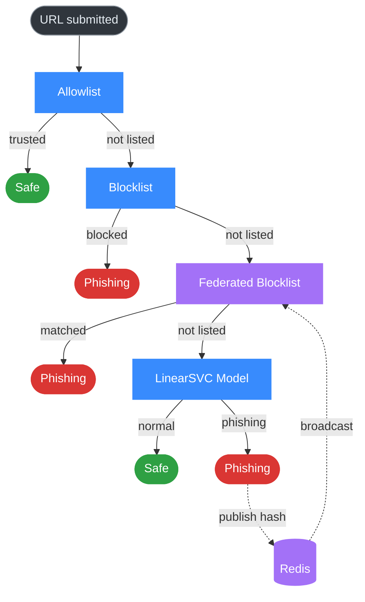

# ECHOLOCK

A federated phishing detection system. When one node catches a threat, every node on the network gets immune to it in seconds.

[Report Bug](https://github.com/ojayballer/ECHOLOCK/issues) · [Request Feature](https://github.com/ojayballer/ECHOLOCK/issues)

> Built for the Cyber AI Hackathon 2025

---

## What this is

Most phishing scanners work alone. One organization finds a malicious URL, flags it internally, and moves on. Meanwhile the same URL is hitting every other target on the internet and nobody else knows about it yet. That gap between discovery and shared knowledge is where attackers live.

ECHOLOCK fixes that. It runs a hybrid validation pipeline where URLs get checked against static lists first, then a federated blocklist shared across all nodes, and finally an ML classifier for anything unknown. When the classifier catches something new with high confidence, it publishes a hash of that threat to a Redis channel. Every other node subscribed to the channel picks it up in milliseconds and adds it to their local blocklist. So a threat that hits Node A at 2:00 PM is already blocked on Node B, C, and D by 2:00:01 PM.

The validation pipeline is designed fast-to-slow. Known good URLs get cleared instantly from the allowlist. Known bad URLs get blocked instantly from the blocklist. The federated layer catches recently discovered threats. The ML model only runs on URLs that made it through everything else. This keeps response times low for the majority of requests while still catching novel attacks.

## How it looks

<table>
<tr>
<td width="50%">

**Main Interface**


</td>
<td width="50%">

**Phishing Detected**


</td>
</tr>
</table>

[](https://youtu.be/kLEeSNlmpAI?si=MA_OgekvEUS16RUk)

---

## Performance

| What | Speed |
|------|-------|
| Detection accuracy | 91% |
| Memory footprint | 45MB |
| Allowlist/Blocklist checks | < 50ms |
| Federated blocklist lookup | < 200ms |
| Full AI pipeline | 2 to 4 seconds |
| Threat propagation across network | < 5 seconds |

---

## How it works

There are four layers, checked in order.

**Static Allowlist.** Trusted domains get approved instantly. No computation needed.

**Static Blocklist.** Known malicious domains get blocked instantly. Same idea.

**Federated Blocklist.** This is the network layer. Every time any node on the network catches a new threat, it publishes a hash to Redis. All other nodes subscribe to that channel and add the hash to their local blocklists. So this layer catches threats that were discovered by other nodes, even if this specific node has never seen them before.

**AI Analysis.** If a URL makes it through all three previous layers, it gets classified by a LinearSVC model. If the model flags it as phishing with high confidence, two things happen. The user gets a phishing verdict, and the URL hash gets published to the federation channel so every other node learns about it too.

Each layer is a checkpoint. The system only moves to the next layer if the current one has no opinion. This means the vast majority of requests never even reach the ML model.

---

## Architecture

The system has four components that run independently.

**Frontend** is a React/TypeScript app built with Vite. It handles the UI, submits URLs to the backend, and displays the verdict with a confidence score.

**Backend API** is a Flask server. This is where the validation pipeline lives. It checks each layer in order, runs the model when needed, and publishes new threats to Redis.

**Federation Worker** is a Python daemon that subscribes to the Redis channel. When it receives a new threat hash, it updates the local federated blocklist. This runs as a separate process alongside the backend.

**Redis Cloud** acts as both the pub/sub message broker and persistent storage for the federation channel.



---

## Tech stack

| Layer | Technologies |
|-------|-------------|
| Backend | Python, Flask, Scikit-learn, Pandas, NumPy |
| Frontend | TypeScript, React, Vite |
| Infrastructure | Redis Cloud |
| Deployment | Railway |

---

## Project structure

```
ECHOLOCK/
├── BACKEND_ECHOLOCK/
│   ├── app.py                    # Flask API, publisher
│   ├── federation.py             # Threat publishing logic
│   ├── federation_worker.py      # Redis subscriber daemon
│   ├── utils.py                  # Model loading and prediction
│   ├── ECHOLOCK.pkl              # Pre-trained LinearSVC model
│   ├── requirements.txt
│   ├── Procfile                  # Railway config
│   └── .env
│
├── FRONTEND/
│   ├── src/
│   │   ├── components/
│   │   ├── pages/
│   │   ├── utils/
│   │   └── App.tsx
│   ├── package.json
│   ├── vite.config.ts
│   └── .env
│
├── MODEL/NOTEBOOK/
│   └── ECHOLOCK.ipynb            # RandomForest experimentation
│
├── examples/
│   ├── normal_verdict.png
│   └── phishing_verdict.png
│
├── .gitignore
├── LICENSE
└── README.md
```

---

## Getting started

You need Python 3.8+, Node.js 14+, and a Redis Cloud account.

### Clone and set up the backend

```bash
git clone https://github.com/ojayballer/ECHOLOCK.git
cd ECHOLOCK/BACKEND_ECHOLOCK
pip install -r requirements.txt
```

Create a `.env` file in `BACKEND_ECHOLOCK/`:

```env
REDIS_HOST=your-redis-host.com
REDIS_PORT=12345
REDIS_PASS=your-password
REDIS_CHANNEL=echolock_federation
```

### Set up the frontend

```bash
cd ../FRONTEND
npm install
```

Create a `.env` file in `FRONTEND/`:

```env
VITE_API_URL=http://127.0.0.1:5000
```

### Run it

You need three terminals.

```bash
# Terminal 1: backend API
cd BACKEND_ECHOLOCK
python app.py
# runs on http://127.0.0.1:5000

# Terminal 2: federation worker
cd BACKEND_ECHOLOCK
python federation_worker.py
# subscribes to Redis channel, listens for threats

# Terminal 3: frontend
cd FRONTEND
npm run dev
# runs on http://localhost:5173
```

Open `http://localhost:5173` and start scanning URLs.

---

## API

### POST /api/check

Submit a URL for analysis.

**Request:**
```json
{
  "url": "https://example.com"
}
```

**Response:**
```json
{
  "url": "https://example.com",
  "verdict": "normal",
  "confidence": 98.5
}
```

The `verdict` field is either `normal` or `phishing`. The `confidence` score ranges from 0 to 100. A confidence of exactly 100.0 usually means the URL was caught by a static list rather than the ML model.

---

## Why LinearSVC

The `MODEL/NOTEBOOK/ECHOLOCK.ipynb` notebook shows my experimentation with a RandomForest classifier that hit 92% accuracy on validation. But I also tried LinearSVC, Logistic Regression, Gradient Boosting, and an LSTM with character-level tokenization through separate training scripts.

I went with LinearSVC for production because it gives the best tradeoff between inference speed and accuracy. RandomForest was slightly more accurate but too slow for a real-time API. The LSTM kept overfitting despite regularization. LinearSVC runs fast enough to handle high request volumes without dropping detection quality, which is what matters for something that needs to respond in real time.

I only included the RandomForest notebook in the repo to keep things clean. It shows the feature engineering and baseline work well enough. The other training scripts were development artifacts.

---

## Roadmap

**Intelligence**
- Global threat feed dashboard with real-time visualization and geographic mapping
- Threat pattern recognition and predictive modeling
- Public API for threat data

**Client integration**
- Browser extension for Chrome and Firefox with real-time scanning
- Mobile app with SMS/email link scanning and QR code analysis

**Enterprise**
- Router-level and network-level deployment
- RESTful public API with rate limiting, auth, webhooks, and batch processing

**AI evolution**
- Retrain an LSTM for sequential analysis
- Transformer-based classification
- Decentralized federation with P2P threat propagation

---

## Contributing

```bash
# Fork the repo, then:
git clone https://github.com/YOUR_USERNAME/ECHOLOCK.git
git checkout -b feature/your-feature
git commit -m 'Add your feature'
git push origin feature/your-feature
# Open a pull request
```

---

## License

MIT. See `LICENSE` for details.

---

**Contact:** [omojiremurewa@gmail.com](mailto:omojiremurewa@gmail.com)

If you find this useful, a star on the repo would be appreciated.
