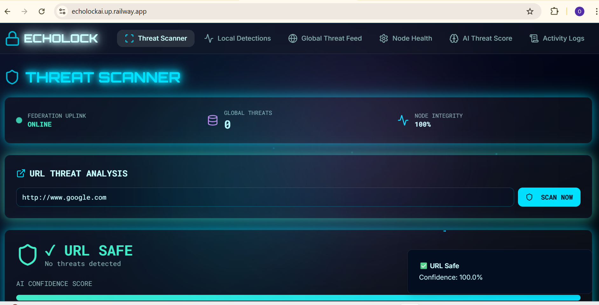
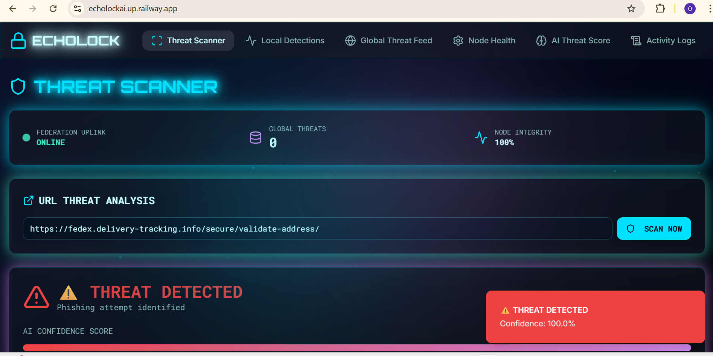

<div align="center">

# ECHOLOCK

### A hybrid, federated AI defense system for real-time, collective phishing detection

[](https://github.com/ojayballer/ECHOLOCK)
[](https://echolockai.up.railway.app/)
[](https://github.com/ojayballer/ECHOLOCK/blob/main/LICENSE)
[](https://github.com/ojayballer/ECHOLOCK)

**[View Live Demo](https://echolockai.up.railway.app/)** • **[Report Bug](https://github.com/ojayballer/ECHOLOCK/issues)** • **[Request Feature](https://github.com/ojayballer/ECHOLOCK/issues)**

</div>

---

## Performance Metrics

<div align="center">

### Detection Performance

| Metric | Value |
|:------:|:-----:|
| **Detection Accuracy** | 91% |
| **Memory Footprint** | 45MB |

### Response Times by Layer

| Validation Layer | Response Time |
|:----------------:|:-------------:|
| **Static Lists (Allow/Block)** | < 50ms |
| **Federated Blocklist** | < 200ms |
| **AI Analysis (Full Pipeline)** | 2-4 seconds |

### Federation Speed

| Metric | Value |
|:------:|:-----:|
| **Threat Propagation** | < 5 seconds |
| **Network Synchronization** | Real-time |

</div>

---

## Overview

ECHOLOCK is a cybersecurity application I designed to combat the growing sophistication of phishing attacks. Unlike traditional, isolated scanners, ECHOLOCK operates as a **collective defense network**. It solves the problem of reactive threat intelligence by implementing a federated architecture.

### The Problem

Traditional phishing detection systems operate in isolation. When one organization discovers a new threat, that knowledge doesn't immediately benefit others. This creates a window of vulnerability where attackers can reuse the same techniques across multiple targets.

### The Solution

When one node in the ECHOLOCK network detects a new, high-confidence threat, that threat's fingerprint (IOC) is instantly published to a central federation server powered by Redis. All other nodes subscribed to the network receive this update in **milliseconds**, granting them **immediate immunity** to a threat they have never even seen.

This is achieved through a **hybrid validation system** that combines multiple layers of defense for maximum speed and accuracy.

> **Built for the Cyber AI Hackathon 2025**

---

## Why ECHOLOCK?

<div align="center">

| Feature | Traditional Scanners | ECHOLOCK |
|---------|---------------------|----------|
| **Threat Sharing** | Isolated | Network-Wide |
| **Detection Speed** | Reactive | Proactive |
| **Zero-Day Response** | Hours/Days | Seconds |
| **Scalability** | Single-Node | Distributed |
| **Intelligence** | Static Lists Only | AI + Federation |

</div>

---

## Application Preview

<table>
<tr>
<td width="50%">

### Main Interface


Clean, intuitive interface for URL submission and analysis

</td>
<td width="50%">

### Threat Detection


Real-time verdict with confidence scoring

</td>
</tr>
</table>

<div align="center">
    
[](https://youtu.be/kLEeSNlmpAI?si=MA_OgekvEUS16RUk)

</div>

---

## Table of Contents

<details open>
<summary><b>Click to expand/collapse</b></summary>

- [Performance Metrics](#performance-metrics)
- [Overview](#overview)
- [Why ECHOLOCK?](#why-echolock)
- [Application Preview](#application-preview)
- [Key Features](#key-features)
- [Architecture](#architecture)
- [Tech Stack](#tech-stack)
- [Project Structure](#project-structure)
- [Quick Start](#quick-start)
- [Usage](#usage)
- [Model Selection](#model-selection)
- [Roadmap](#roadmap)
- [Contributing](#contributing)
- [License](#license)

</details>

---

## Key Features

### Multi-Layer Hybrid Validation

ECHOLOCK employs a sophisticated **fast-to-slow** validation pipeline:

<div align="center">

```
╔═══════════════════════════════════════╗
║  VALIDATION PIPELINE                  ║
╠═══════════════════════════════════════╣
║                                       ║
║  ① Static Allowlist                  ║
║     └─→ Instant approval for trusted ║
║                                       ║
║  ② Static Blocklist                  ║
║     └─→ Instant block for known bad  ║
║                                       ║
║  ③ Federated Blocklist               ║
║     └─→ Check federation intel       ║
║                                       ║
║  ④ AI Analysis (LinearSVC)           ║
║     └─→ ML classification            ║
║                                       ║
╚═══════════════════════════════════════╝
```

</div>

Each layer acts as a checkpoint, ensuring **maximum speed** for known URLs while maintaining **accuracy** for unknown threats.

---

### Federation Architecture

Built on **Redis Pub/Sub** for real-time threat intelligence sharing:

<div align="center">

```
    NODE A              REDIS              NODE B
 (Publisher)          (Broker)         (Subscriber)
      │                  │                  │
      │  Detects Threat  │                  │
      ├─────────────────>│                  │
      │                  │                  │
      │   Publishes Hash │   Subscribes    │
      │                  │<─────────────────┤
      │                  │                  │
      │                  │  Propagates      │
      │                  ├─────────────────>│
      │                  │                  │
      │                  │   Updates DB     │
      │                  │                  ├──┐
      │                  │                  │  │
      │                  │                  │<─┘
      
   ✓ Attack on Node A → All Nodes Immune
```

</div>

---

### Instant Immunity

- **Threat Propagation:** < 5 seconds
- **Network-Wide Protection:** Simultaneous
- **Zero-Day Response:** Real-time

---

### Decoupled Architecture

- **Frontend** — TypeScript/React interface
- **Backend API** — Flask orchestration layer
- **Federation Worker** — Python subscriber
- **Redis Cloud** — Pub/Sub broker + Database

---

## Architecture

### System Flow Diagram

<div align="center">

```
┌─────────────────────────────────────────────────────────────────────────────┐
│                              ECHOLOCK ECOSYSTEM                              │
└─────────────────────────────────────────────────────────────────────────────┘

                            ┌──────────────┐
                            │    USER      │
                            │   BROWSER    │
                            └───────┬──────┘
                                    │
                            HTTPS Request
                                    │
                                    ▼
            ╔═══════════════════════════════════════════════════╗
            ║           FRONTEND (React/TypeScript)             ║
            ║  • User Interface                                 ║
            ║  • Real-time Visualization                        ║
            ║  • Confidence Scoring Display                     ║
            ╚═══════════════════════════════════════════════════╝
                                    │
                            POST /api/check
                                    │
                                    ▼
            ╔═══════════════════════════════════════════════════╗
            ║            BACKEND API (Flask/Python)             ║
            ║                                                   ║
            ║  ┌─────────────┐  ┌─────────────┐               ║
            ║  │ Allowlist   │→ │ Blocklist   │               ║
            ║  │   Check     │  │   Check     │               ║
            ║  └─────────────┘  └─────────────┘               ║
            ║                          │                        ║
            ║                          ▼                        ║
            ║                  ┌─────────────┐                 ║
            ║                  │  Federated  │                 ║
            ║                  │  Blocklist  │                 ║
            ║                  └─────────────┘                 ║
            ║                          │                        ║
            ║                          ▼                        ║
            ║                  ┌─────────────┐                 ║
            ║                  │ AI Analysis │                 ║
            ║                  │  (LinearSVC)│                 ║
            ║                  └─────────────┘                 ║
            ║                          │                        ║
            ║                   If Phishing                     ║
            ║                          │                        ║
            ╚══════════════════════════┼════════════════════════╝
                                       │
                              Publish Hash
                                       │
                                       ▼
            ╔═══════════════════════════════════════════════════╗
            ║         REDIS CLOUD (Pub/Sub + Database)          ║
            ║  • Message Broker                                 ║
            ║  • Persistent Storage                             ║
            ║  • Federation Channel                             ║
            ╚═══════════════════════════════════════════════════╝
                                       │
                                  Subscribe
                                       │
                                       ▼
            ╔═══════════════════════════════════════════════════╗
            ║        FEDERATION WORKER (Python Daemon)          ║
            ║  • Listens to Redis Channel                       ║
            ║  • Updates Federated Blocklist                    ║
            ║  • Ensures All Nodes Stay Synchronized            ║
            ╚═══════════════════════════════════════════════════╝
```

</div>

### Component Responsibilities

<table>
<tr>
<th>Component</th>
<th>Primary Role</th>
<th>Technology</th>
</tr>
<tr>
<td><b>Frontend</b></td>
<td>User interface and result visualization</td>
<td>TypeScript, React, Vite</td>
</tr>
<tr>
<td><b>Backend API</b></td>
<td>Orchestrates validation logic, publishes threats</td>
<td>Python, Flask</td>
</tr>
<tr>
<td><b>Federation Worker</b></td>
<td>Subscribes to threats, updates blocklist</td>
<td>Python, Redis Client</td>
</tr>
<tr>
<td><b>Redis Cloud</b></td>
<td>Message broker and persistent storage</td>
<td>Redis Pub/Sub</td>
</tr>
<tr>
<td><b>ML Model</b></td>
<td>Classifies unknown URLs</td>
<td>Scikit-learn (LinearSVC)</td>
</tr>
</table>

---

## Tech Stack

<div align="center">

### Backend Technologies

<p>
  
</p>


### Frontend Technologies

<p>
  
</p>


### Machine Learning & Data Processing


### Infrastructure

<p>
  
</p>


### Deployment


</div>

---

## Project Structure
```
ECHOLOCK/
│
├── BACKEND_ECHOLOCK/
│   ├── app.py                    # Flask API (Publisher)
│   ├── federation.py             # Threat publishing logic
│   ├── federation_worker.py      # Redis subscriber daemon
│   ├── utils.py                  # Model loading & prediction
│   ├── ECHOLOCK.pkl              # Pre-trained LinearSVC model
│   ├── requirements.txt          # Python dependencies
│   ├── Procfile                  # Railway deployment config
│   └── .env                      # Environment variables
│
├── FRONTEND/
│   ├── src/
│   │   ├── components/           # React components
│   │   ├── pages/                # Application pages
│   │   ├── utils/                # Helper functions
│   │   └── App.tsx               # Main application
│   ├── public/
│   ├── package.json              # Node dependencies
│   ├── vite.config.ts            # Vite configuration
│   └── .env                      # Environment variables
│
├── MODEL/NOTEBOOK/
│   └── ECHOLOCK.ipynb            # RandomForest experimentation
│
├── examples/
│   ├── normal_verdict.png
│   └── phishing_verdict.png
│
├── .gitignore
├── LICENSE
└── README.md
```

---

## Quick Start

### Prerequisites

<table>
<tr>
<td align="center" width="33%">

**Python**


</td>
<td align="center" width="33%">

**Node.js**


</td>
<td align="center" width="33%">

**Redis**


</td>
</tr>
</table>

### Installation

#### Step 1: Clone Repository
```bash
git clone https://github.com/ojayballer/ECHOLOCK.git
cd ECHOLOCK
```

#### Step 2: Backend Configuration
```bash
cd BACKEND_ECHOLOCK
pip install -r requirements.txt
```

Create `.env` file:
```env
REDIS_HOST=your-redis-host.com
REDIS_PORT=12345
REDIS_PASS=your-password
REDIS_CHANNEL=echolock_federation
```

#### Step 3: Frontend Configuration
```bash
cd ../FRONTEND
npm install
```

Create `.env` file:
```env
VITE_API_URL=http://127.0.0.1:5000
```

---

## Usage

### Starting the Application

<table>
<tr>
<td width="33%" align="center">

**Terminal 1**

### Backend API
```bash
cd BACKEND_ECHOLOCK
python app.py
```

**Status:** 
```
✓ Running on 
  http://127.0.0.1:5000
```

</td>
<td width="33%" align="center">

**Terminal 2**

### Federation Worker
```bash
cd BACKEND_ECHOLOCK
python federation_worker.py
```

**Status:**
```
✓ Subscribed to channel
  Listening for threats...
```

</td>
<td width="33%" align="center">

**Terminal 3**

### Frontend
```bash
cd FRONTEND
npm run dev
```

**Status:**
```
✓ Local server
  http://localhost:5173
```

</td>
</tr>
</table>

<div align="center">

**Navigate to `http://localhost:5173` to use ECHOLOCK**

</div>

---

### API Reference

#### `POST /api/check`

Analyzes a submitted URL and returns a comprehensive verdict.

<table>
<tr>
<td width="50%">

**Request Example**
```json
POST /api/check
Content-Type: application/json

{
  "url": "https://example.com"
}
```

</td>
<td width="50%">

**Response Example**
```json
HTTP/1.1 200 OK
Content-Type: application/json

{
  "url": "https://example.com",
  "verdict": "normal",
  "confidence": 98.5
}
```

</td>
</tr>
</table>

#### Response Fields

| Field | Type | Description | Possible Values |
|-------|------|-------------|-----------------|
| `url` | `string` | The analyzed URL | Any valid URL |
| `verdict` | `string` | Classification result | `normal`, `phishing` |
| `confidence` | `float` | Model certainty score | 0.0 - 100.0 |

> **Note:** A confidence score of `100.0` typically indicates the URL was caught by a static list rather than ML analysis.

---

## Model Selection

### Experimentation Process

The `MODEL/NOTEBOOK/ECHOLOCK.ipynb` notebook documents part of my experimentation process, specifically my work with a **RandomForest** classifier that achieved **92% accuracy** on the validation set.

However, my model selection process extended beyond what is shown in the notebook. I experimented with multiple algorithms including **LinearSVC**, **Logistic Regression**, **Gradient Boosting**, and even explored **LSTM networks** with character-level tokenization for sequence-based feature learning through separate training scripts.

### Why LinearSVC?

After extensive benchmarking, I chose **LinearSVC** for production deployment because it provides the optimal balance of **high inference speed** and **strong predictive accuracy**, which is critical for a low-latency, real-time API. 

While RandomForest demonstrated slightly higher accuracy and LSTMs showed promise in capturing sequential patterns, they came with significant trade-offs. The LSTM approach suffered from overfitting issues despite regularization attempts, and RandomForest's inference time was too slow for real-time requirements. LinearSVC's efficient linear decision boundary computation allows ECHOLOCK to handle high request volumes without sacrificing detection performance, making it the clear choice for a production environment.

### Repository Contents

I chose to include only the RandomForest experimentation notebook in the repository to keep the project structure clean and focused. It effectively illustrates my approach to feature engineering and baseline model development. The additional experimentation notebooks, including LSTM implementations and hyperparameter tuning scripts, were development artifacts that I opted not to include in the final repository.

---

## Roadmap

<table>
<tr>
<td width="50%">

### Phase 1: Intelligence Enhancement

- [ ] **Global Threat Feed Dashboard**
  - Real-time threat visualization
  - Geographic threat mapping
  - Historical trend analysis
  - Public API for threat data

- [ ] **Advanced Analytics**
  - Threat pattern recognition
  - Attack vector analysis
  - Predictive threat modeling

</td>
<td width="50%">

### Phase 2: Client Integration

- [ ] **Browser Extension**
  - Chrome/Firefox support
  - Real-time URL scanning
  - Passive background monitoring
  - Low resource footprint

- [ ] **Mobile Application**
  - iOS and Android support
  - SMS/Email link scanning
  - QR code analysis

</td>
</tr>
<tr>
<td width="50%">

### Phase 3: Enterprise Features

- [ ] **Router Integration**
  - Network-level deployment
  - ISP partnership opportunities
  - Corporate firewall integration
  - Zero-touch configuration

- [ ] **API Gateway**
  - RESTful public API
  - Rate limiting and authentication
  - Webhook notifications
  - Batch processing support

</td>
<td width="50%">

### Phase 4: AI Evolution

- [ ] **Deep Learning Models**
  - Retrain a new LSTM network for sequential analysis
  - Transformer-based classification
  - Multi-modal threat detection
  - Adversarial training

- [ ] **Decentralized Federation**
  - Blockchain-based verification
  - P2P threat propagation
  - Eliminate single point of failure
  - Trust scoring system

</td>
</tr>
</table>

---

## Contributing

**Contributions are what make the open-source community an amazing place to learn and create.**

### How to Contribute
```bash
# 1. Fork the Project
# Click the 'Fork' button at the top right of this page

# 2. Clone your fork
git clone https://github.com/YOUR_USERNAME/ECHOLOCK.git

# 3. Create a feature branch
git checkout -b feature/AmazingFeature

# 4. Make your changes and commit
git commit -m 'Add some AmazingFeature'

# 5. Push to your branch
git push origin feature/AmazingFeature

# 6. Open a Pull Request
# Go to the original repo and click 'New Pull Request'
```

### Contribution Guidelines

- Write clear, descriptive commit messages
- Follow the existing code style
- Add tests for new features
- Update documentation as needed
- Be respectful and constructive in discussions

---

## License

<div align="center">

Distributed under the **MIT License**. See `LICENSE` file for more information.

[](https://opensource.org/licenses/MIT)

</div>

---

<div align="center">

## Contact & Links

**Author:** [ojayballer](https://github.com/ojayballer)

**Gmail:** [omojiremurewa@gmail.com](mailto:omojiremurewa@gmail.com)

**Project Repository:** [github.com/ojayballer/ECHOLOCK](https://github.com/ojayballer/ECHOLOCK)

**Live Deployment:** [echolockai.up.railway.app](https://echolockai.up.railway.app/)

---

### Support This Project

If you find ECHOLOCK useful, please consider giving it a star on GitHub!

---


**Built with passion for the Cyber AI Hackathon 2025**

</div>
